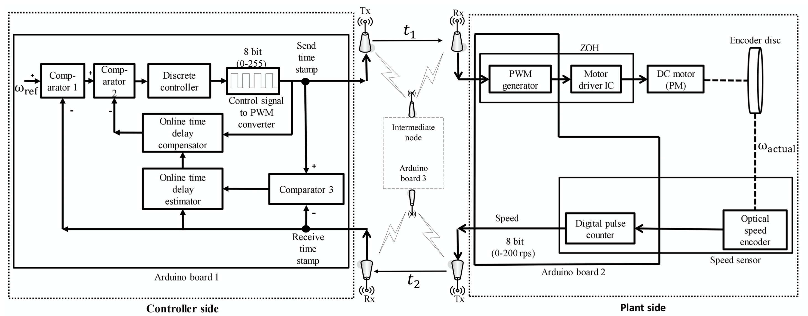

## Online time delay estimation and adaptive compensation in wireless networked control system

> Implemented in Arduino embedded platform using Bluetooth technology

- This project has got published as a journal article below :
 [<b>SOnline Delay Estimation and Adaptive Compensation in Wireless Networked System: An Embedded Control Design</b>](https://link.springer.com/article/10.1007/s12555-018-0612-x) 

### Block diagram of the set up

 
  <kbd>
    
  </kbd>

